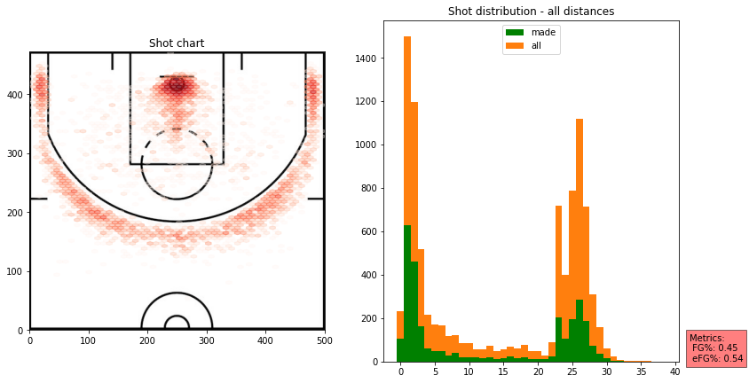

# Shot Chart


<!-- WARNING: THIS FILE WAS AUTOGENERATED! DO NOT EDIT! -->

``` python
#hide
from shot_chart.core import *
```

This file will become your README and also the index of your
documentation.

## Install

`pip install shot_chart`

## How to use

We first create a pandas dataframe from the source data.

``` python
shots_2019 = make_df(untar_data(URLs.SHOTS_2019))
```

## Listing teams for the season

``` python
list_teams(shots_2019)
```

    0        New Orleans
    2            Toronto
    203        LA Lakers
    204      LA Clippers
    369          Houston
    371       Washington
    563             Utah
    724          Detroit
    896        Charlotte
    897       Sacramento
    1076       Minnesota
    1077    Philadelphia
    1248        New York
    1250         Orlando
    1418        Oklahoma
    1419        Portland
    1587         Phoenix
    1588    Golden State
    2117          Dallas
    2307         Memphis
    2309         Chicago
    2649          Denver
    3000        Brooklyn
    3874       Milwaukee
    4562     San Antonio
    5436         Indiana
    5606          Boston
    5951         Atlanta
    6863           Miami
    6864       Cleveland
    Name: team, dtype: object

## Listing players who took at least 1 shot for a particular team

``` python
list_team_players(shots_2019, 'Portland')
```

<div>
<style scoped>
    .dataframe tbody tr th:only-of-type {
        vertical-align: middle;
    }
&#10;    .dataframe tbody tr th {
        vertical-align: top;
    }
&#10;    .dataframe thead th {
        text-align: right;
    }
</style>

|     | shots_by         | count |
|-----|------------------|-------|
| 2   | CJ McCollum      | 1356  |
| 5   | Damian Lillard   | 1344  |
| 4   | Carmelo Anthony  | 781   |
| 7   | Hassan Whiteside | 702   |
| 0   | Anfernee Simons  | 532   |
| 6   | Gary Trent       | 440   |
| 10  | Kent Bazemore    | 322   |
| 11  | Mario Hezonja    | 217   |
| 14  | Rodney Hood      | 172   |
| 16  | Trevor Ariza     | 159   |
| 13  | Nassir Little    | 151   |
| 15  | Skal Labissière  | 147   |
| 1   | Anthony Tolliver | 117   |
| 9   | Jusuf Nurkić     | 109   |
| 18  | Zach Collins     | 68    |
| 3   | Caleb Swanigan   | 43    |
| 8   | Jaylen Hoard     | 32    |
| 17  | Wenyen Gabriel   | 31    |
| 12  | Moses Brown      | 10    |

</div>

## Plotting team shot distribution

``` python
houston = TeamShots(shots_2019,"Houston")
```

``` python
houston.plot_shots()
```



``` python
houston.plot_shots(date_range=((2020,1,3), (2020,1,11)))
```


Please check the extra options when using the plotting functions

``` python
portland_20191125 = TeamShots(shots_2019,"Portland")
```

``` python
portland_20191125.list_game_ids(2019,11,25)
```

<div>
<style scoped>
    .dataframe tbody tr th:only-of-type {
        vertical-align: middle;
    }
&#10;    .dataframe tbody tr th {
        vertical-align: top;
    }
&#10;    .dataframe thead th {
        text-align: right;
    }
</style>

|       | game_id      | winner   | loser   |
|-------|--------------|----------|---------|
| 46637 | 201911250CHI | Portland | Chicago |

</div>

``` python
portland_20191125.plot_shots("201911250CHI")
```


## Plotting player shot distribution

``` python
player_shots = PlayerShots(shots_2019,"Anthony Davis")
```

``` python
player_shots.plot_shots()
```


``` python
dlo = PlayerShots(shots_2019,"D'Angelo Russell")
```

``` python
dlo.plot_shots()
```


``` python
dlo.plot_shots(distance_limit=(16,26),attempt="2-pointer")
```


``` python
dlo.plot_effective(most_or_least="most")
```


``` python
dlo.plot_effective(most_or_least="most",exclude=["0ft"])
```


``` python
dlo.plot_effective(most_or_least="most",min_shots="auto",exclude=['2ft'])
```


``` python
dlo.plot_effective(most_or_least="least")
```


``` python
dlo.plot_effective(most_or_least="least",min_shots="auto")
```


