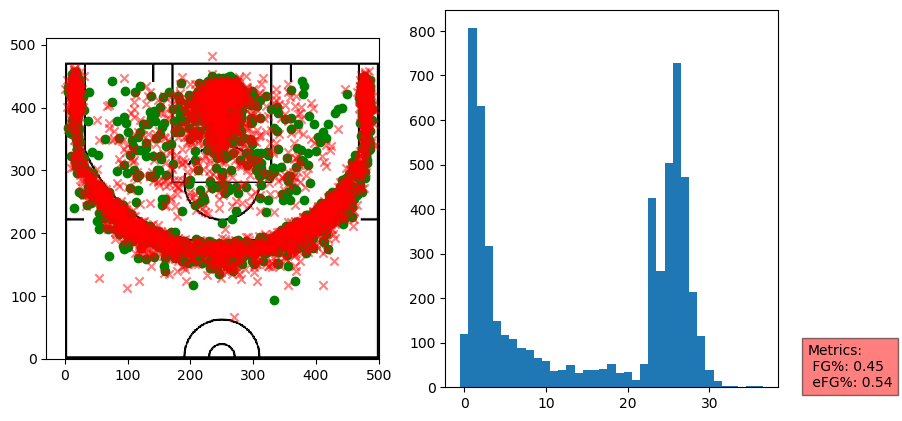
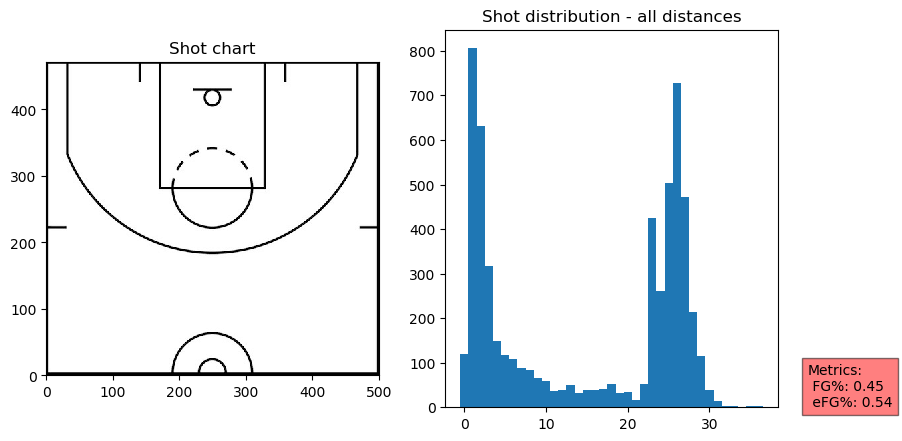
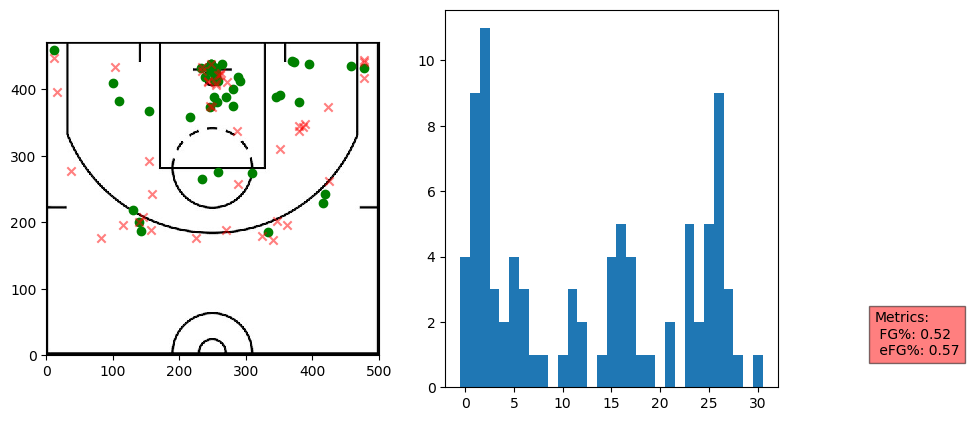

# Shot Chart
> Python module to plot NBA shot chart data and distributions for players and teams and some utilities.


This file will become your README and also the index of your documentation.

## Install

`pip install shot_chart`

## How to use

We first create a pandas dataframe from the source data.

```python
shots_2019 = make_df(untar_data(URLs.SHOTS_2019))
```

## Listing teams for the season

```python
list_teams(shots_2019)
```


    0            Atlanta
    1            Orlando
    183       Sacramento
    184             Utah
    341         Oklahoma
    343     Golden State
    511           Denver
    512      New Orleans
    675        Milwaukee
    1016        Portland
    1224         Phoenix
    1226        Brooklyn
    1412     San Antonio
    1413         Memphis
    1934         Toronto
    2119    Philadelphia
    2296       Minnesota
    2477       LA Lakers
    2655         Houston
    2656     LA Clippers
    2843       Charlotte
    3017          Boston
    3018      Washington
    3383         Detroit
    3918           Miami
    5020       Cleveland
    5535         Indiana
    6407        New York
    6410         Chicago
    8473          Dallas
    Name: team, dtype: object


## Listing players who took at least 1 shot for a particular team

```python
list_team_players(shots_2019, 'Portland')
```


<div>
<style scoped>
    .dataframe tbody tr th:only-of-type {
        vertical-align: middle;
    }

    .dataframe tbody tr th {
        vertical-align: top;
    }

    .dataframe thead th {
        text-align: right;
    }
</style>
<table border="1" class="dataframe">
  <thead>
    <tr style="text-align: right;">
      <th></th>
      <th>shots_by</th>
      <th>count</th>
    </tr>
  </thead>
  <tbody>
    <tr>
      <th>2</th>
      <td>CJ McCollum</td>
      <td>1212</td>
    </tr>
    <tr>
      <th>5</th>
      <td>Damian Lillard</td>
      <td>1158</td>
    </tr>
    <tr>
      <th>4</th>
      <td>Carmelo Anthony</td>
      <td>678</td>
    </tr>
    <tr>
      <th>7</th>
      <td>Hassan Whiteside</td>
      <td>676</td>
    </tr>
    <tr>
      <th>0</th>
      <td>Anfernee Simons</td>
      <td>522</td>
    </tr>
    <tr>
      <th>6</th>
      <td>Gary Trent</td>
      <td>349</td>
    </tr>
    <tr>
      <th>9</th>
      <td>Kent Bazemore</td>
      <td>322</td>
    </tr>
    <tr>
      <th>10</th>
      <td>Mario Hezonja</td>
      <td>188</td>
    </tr>
    <tr>
      <th>13</th>
      <td>Rodney Hood</td>
      <td>172</td>
    </tr>
    <tr>
      <th>15</th>
      <td>Trevor Ariza</td>
      <td>159</td>
    </tr>
    <tr>
      <th>12</th>
      <td>Nassir Little</td>
      <td>151</td>
    </tr>
    <tr>
      <th>14</th>
      <td>Skal Labissière</td>
      <td>147</td>
    </tr>
    <tr>
      <th>1</th>
      <td>Anthony Tolliver</td>
      <td>117</td>
    </tr>
    <tr>
      <th>3</th>
      <td>Caleb Swanigan</td>
      <td>43</td>
    </tr>
    <tr>
      <th>8</th>
      <td>Jaylen Hoard</td>
      <td>32</td>
    </tr>
    <tr>
      <th>16</th>
      <td>Wenyen Gabriel</td>
      <td>29</td>
    </tr>
    <tr>
      <th>17</th>
      <td>Zach Collins</td>
      <td>19</td>
    </tr>
    <tr>
      <th>11</th>
      <td>Moses Brown</td>
      <td>10</td>
    </tr>
  </tbody>
</table>
</div>


### List the games for a given day

```python
list_game_ids(shots_2019, 2020, 1, 20)
```


<div>
<style scoped>
    .dataframe tbody tr th:only-of-type {
        vertical-align: middle;
    }

    .dataframe tbody tr th {
        vertical-align: top;
    }

    .dataframe thead th {
        text-align: right;
    }
</style>
<table border="1" class="dataframe">
  <thead>
    <tr style="text-align: right;">
      <th></th>
      <th>game_id</th>
      <th>winner</th>
      <th>loser</th>
    </tr>
  </thead>
  <tbody>
    <tr>
      <th>112968</th>
      <td>202001200ATL</td>
      <td>Toronto</td>
      <td>Atlanta</td>
    </tr>
    <tr>
      <th>113331</th>
      <td>202001200WAS</td>
      <td>Washington</td>
      <td>Detroit</td>
    </tr>
    <tr>
      <th>113681</th>
      <td>202001200POR</td>
      <td>Portland</td>
      <td>Golden State</td>
    </tr>
    <tr>
      <th>113896</th>
      <td>202001200UTA</td>
      <td>Utah</td>
      <td>Indiana</td>
    </tr>
    <tr>
      <th>114075</th>
      <td>202001200MEM</td>
      <td>New Orleans</td>
      <td>Memphis</td>
    </tr>
    <tr>
      <th>114266</th>
      <td>202001200MIA</td>
      <td>Miami</td>
      <td>Sacramento</td>
    </tr>
    <tr>
      <th>114455</th>
      <td>202001200MIL</td>
      <td>Milwaukee</td>
      <td>Chicago</td>
    </tr>
    <tr>
      <th>114625</th>
      <td>202001200HOU</td>
      <td>Oklahoma City</td>
      <td>Houston</td>
    </tr>
    <tr>
      <th>114813</th>
      <td>202001200MIN</td>
      <td>Denver</td>
      <td>Minnesota</td>
    </tr>
    <tr>
      <th>115164</th>
      <td>202001200PHO</td>
      <td>San Antonio</td>
      <td>Phoenix</td>
    </tr>
    <tr>
      <th>124108</th>
      <td>202001200CLE</td>
      <td>New York</td>
      <td>Cleveland</td>
    </tr>
    <tr>
      <th>124287</th>
      <td>202001200CHO</td>
      <td>Orlando</td>
      <td>Charlotte</td>
    </tr>
    <tr>
      <th>124455</th>
      <td>202001200BOS</td>
      <td>Boston</td>
      <td>LA Lakers</td>
    </tr>
    <tr>
      <th>124817</th>
      <td>202001200BRK</td>
      <td>Philadelphia</td>
      <td>Brooklyn</td>
    </tr>
  </tbody>
</table>
</div>


Note how the game_id format is YYYYMMDD0WIN

## Plotting team shot distribution

```python
houston = TeamShots(shots_2019,"Houston")
```

```python
houston.plot_shots()
```





```python
houston.plot_shots(date_range=((2020,1,3), (2020,1,11)))
```





Please check the extra options when using the plotting functions

```python
portland_20191125 = TeamShots(shots_2019,"Portland","201911250CHI")
```

```python
portland_20191125.plot_shots()
```





## Plotting player shot distribution

```python
player_shots = PlayerShots(shots_2019,"Anthony Davis")
```

```python
player_shots.plot_shots()
```


```python
dlo = PlayerShots(shots_2019,"D'Angelo Russell")
```

```python
dlo.plot_shots()
```


```python
dlo.plot_shots(distances=["16ft","17ft","18ft","19ft","20ft","21ft","22ft","23ft","24ft","25ft","26ft"],attempt="2-pointer")
```


```python
dlo.plot_effective(most_or_least="most")
```


```python
dlo.plot_effective(most_or_least="most",exclude=["0ft"])
```


