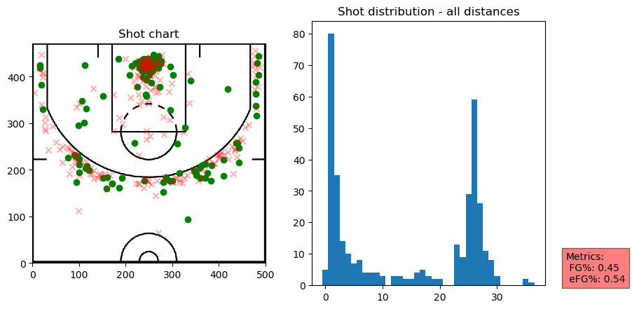
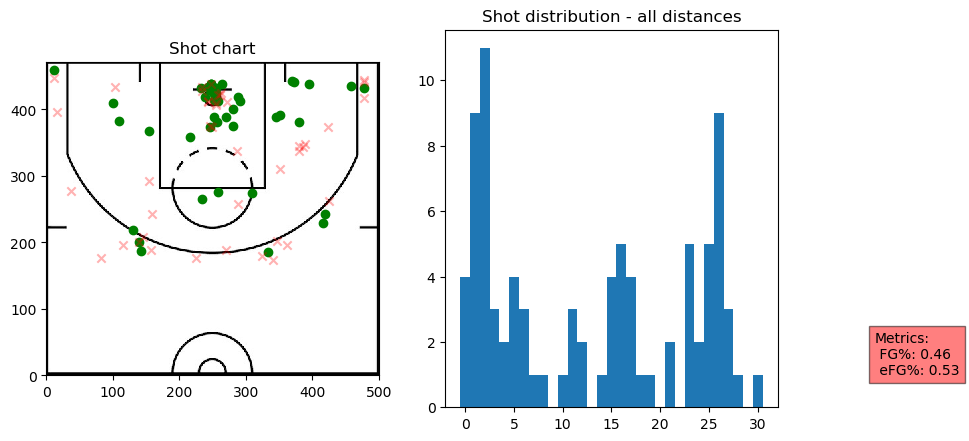
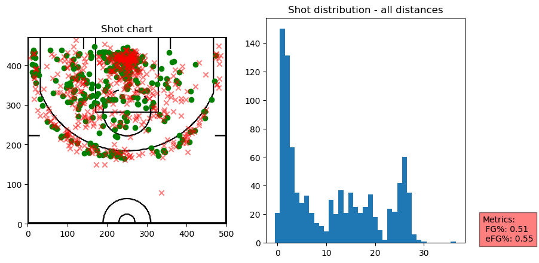

# Shot Chart
> Python module to plot NBA shot chart data and distributions for players and teams and some utilities.


This file will become your README and also the index of your documentation.

## Install

`pip install shot_chart`

## How to use

We first create a pandas dataframe from the source data.

```python
shots_2019 = make_df(untar_data(URLs.SHOTS_2019))
```

## Listing teams for the season

```python
list_teams(shots_2019)
```


    0            Atlanta
    1            Orlando
    183       Sacramento
    184             Utah
    341         Oklahoma
    343     Golden State
    511           Denver
    512      New Orleans
    675        Milwaukee
    1016        Portland
    1224         Phoenix
    1226        Brooklyn
    1412     San Antonio
    1413         Memphis
    1934         Toronto
    2119    Philadelphia
    2296       Minnesota
    2477       LA Lakers
    2655         Houston
    2656     LA Clippers
    2843       Charlotte
    3017          Boston
    3018      Washington
    3383         Detroit
    3918           Miami
    5020       Cleveland
    5535         Indiana
    6407        New York
    6410         Chicago
    8473          Dallas
    Name: team, dtype: object


## Listing players who took at least 1 shot for a particular team

```python
list_team_players(shots_2019, 'Portland')
```


<div>
<style scoped>
    .dataframe tbody tr th:only-of-type {
        vertical-align: middle;
    }

    .dataframe tbody tr th {
        vertical-align: top;
    }

    .dataframe thead th {
        text-align: right;
    }
</style>
<table border="1" class="dataframe">
  <thead>
    <tr style="text-align: right;">
      <th></th>
      <th>shots_by</th>
      <th>count</th>
    </tr>
  </thead>
  <tbody>
    <tr>
      <th>2</th>
      <td>CJ McCollum</td>
      <td>1212</td>
    </tr>
    <tr>
      <th>5</th>
      <td>Damian Lillard</td>
      <td>1158</td>
    </tr>
    <tr>
      <th>4</th>
      <td>Carmelo Anthony</td>
      <td>678</td>
    </tr>
    <tr>
      <th>7</th>
      <td>Hassan Whiteside</td>
      <td>676</td>
    </tr>
    <tr>
      <th>0</th>
      <td>Anfernee Simons</td>
      <td>522</td>
    </tr>
    <tr>
      <th>6</th>
      <td>Gary Trent</td>
      <td>349</td>
    </tr>
    <tr>
      <th>9</th>
      <td>Kent Bazemore</td>
      <td>322</td>
    </tr>
    <tr>
      <th>10</th>
      <td>Mario Hezonja</td>
      <td>188</td>
    </tr>
    <tr>
      <th>13</th>
      <td>Rodney Hood</td>
      <td>172</td>
    </tr>
    <tr>
      <th>15</th>
      <td>Trevor Ariza</td>
      <td>159</td>
    </tr>
    <tr>
      <th>12</th>
      <td>Nassir Little</td>
      <td>151</td>
    </tr>
    <tr>
      <th>14</th>
      <td>Skal Labissière</td>
      <td>147</td>
    </tr>
    <tr>
      <th>1</th>
      <td>Anthony Tolliver</td>
      <td>117</td>
    </tr>
    <tr>
      <th>3</th>
      <td>Caleb Swanigan</td>
      <td>43</td>
    </tr>
    <tr>
      <th>8</th>
      <td>Jaylen Hoard</td>
      <td>32</td>
    </tr>
    <tr>
      <th>16</th>
      <td>Wenyen Gabriel</td>
      <td>29</td>
    </tr>
    <tr>
      <th>17</th>
      <td>Zach Collins</td>
      <td>19</td>
    </tr>
    <tr>
      <th>11</th>
      <td>Moses Brown</td>
      <td>10</td>
    </tr>
  </tbody>
</table>
</div>


Note how the game_id format is YYYYMMDD0WIN

## Plotting team shot distribution

```python
houston = TeamShots(shots_2019,"Houston")
```

```python
houston.plot_shots()
```


```python
houston.plot_shots(date_range=((2020,1,3), (2020,1,11)))
```





Please check the extra options when using the plotting functions

```python
portland_20191125 = TeamShots(shots_2019,"Portland")
```

```python
portland_20191125.list_game_ids(2019,11,25)
```


<div>
<style scoped>
    .dataframe tbody tr th:only-of-type {
        vertical-align: middle;
    }

    .dataframe tbody tr th {
        vertical-align: top;
    }

    .dataframe thead th {
        text-align: right;
    }
</style>
<table border="1" class="dataframe">
  <thead>
    <tr style="text-align: right;">
      <th></th>
      <th>game_id</th>
      <th>winner</th>
      <th>loser</th>
    </tr>
  </thead>
  <tbody>
    <tr>
      <th>45560</th>
      <td>201911250CHI</td>
      <td>Portland</td>
      <td>Chicago</td>
    </tr>
  </tbody>
</table>
</div>


```python
portland_20191125.plot_shots("201911250CHI")
```





## Plotting player shot distribution

```python
player_shots = PlayerShots(shots_2019,"Anthony Davis")
```

```python
player_shots.plot_shots()
```





```python
dlo = PlayerShots(shots_2019,"D'Angelo Russell")
```

```python
dlo.plot_shots()
```


```python
dlo.plot_shots(distances=["16ft","17ft","18ft","19ft","20ft","21ft","22ft","23ft","24ft","25ft","26ft"],attempt="2-pointer")
```


```python
dlo.plot_effective(most_or_least="most")
```


```python
dlo.plot_effective(most_or_least="most",exclude=["0ft"])
```


## Bonus - calculating adjusted eFG

```python
# Dictionary of strings and ints
players_aeFG = {}
for player in shots_2019['shots_by'].drop_duplicates().to_list():
    players_aeFG.update( {player : PlayerShots(shots_2019, player).aeFG} )
```

```python
sorted(players_aeFG.items(), key=lambda x:x[1])
```


    [('Josh Reaves', -0.19983349983349985),
     ('Talen Horton-Tucker', -0.1998203377650018),
     ('Isaiah Roby', -0.199815668202765),
     ('Malik Newman', -0.19964949176305644),
     ('Miye Oni', -0.19962914889671798),
     ('Vic Law', -0.19947285187137587),
     ('Quinndary Weatherspoon', -0.19946723494938734),
     ('Stanton Kidd', -0.19944372334507696),
     ('William Howard', -0.1993091537132988),
     ('Chasson Randle', -0.19929996499824992),
     ('Luka Šamanić', -0.1992896465991831),
     ('Joe Chealey', -0.19874416935773234),
     ('Paul Watson', -0.1986779044785986),
     ('Kevin Hervey', -0.10797235023041477),
     ('Jarrod Uthoff', -0.058812754409769324),
     ('Henry Ellenson', -0.05878197320341047),
     ('Nigel Williams-Goss', -0.05870202113851289),
     ('Justin Anderson', -0.02895597703149469),
     ('Udonis Haslem', -0.028902305159165753),
     ('Jeremiah Martin', 0.0008700191404210911),
     ('Tariq Owens', 0.0008773469029654257),
     ('Dewan Hernandez', 0.0008851124092759677),
     ('Devon Hall', 0.0009216589861751057),
     ('Brian Bowen', 0.021569311246730588),
     ('Matt Mooney', 0.05070101647388714),
     ('Jared Harper', 0.05070187752237232),
     ('Donta Hall', 0.05071377587437542),
     ('Zhaire Smith', 0.07193935119887168),
     ('Stanley Johnson', 0.09548769693751102),
     ('Marial Shayok', 0.10088152327221439),
     ('Jonah Bolden', 0.10176304654442875),
     ('Jordan Bone', 0.1035688793718772),
     ('Ignas Brazdeikis', 0.10373641304347825),
     ('B.J. Johnson', 0.11316288877174485),
     ('Frank Mason', 0.1232089174125992),
     ('Gabe Vincent', 0.12347603366264176),
     ('Antonius Cleveland', 0.13099900099900103),
     ('Tyrone Wallace', 0.14710626342753264),
     ('Al-Farouq Aminu', 0.15511157968722544),
     ('Ryan Anderson', 0.1612089810017271),
     ('Amile Jefferson', 0.162460024600246),
     ('Michael Kidd-Gilchrist', 0.1707642626480086),
     ('Josh Magette', 0.1726357406431207),
     ('Theo Pinson', 0.17644858186880108),
     ('Evan Turner', 0.1810725499917369),
     ('Zach Norvell', 0.18215594681997843),
     ('Chandler Parsons', 0.1929747149231532),
     ('Charlie Brown', 0.1931399768633284),
     ('Kevon Looney', 0.1936506825341267),
     ('Tremont Waters', 0.19612102133613152),
     ('Jaylen Nowell', 0.19908311910882603),
     ('Zylan Cheatham', 0.20085062946580473),
     ('Iman Shumpert', 0.20113624499738997),
     ('Moses Brown', 0.2016711229946524),
     ('Jalen Lecque', 0.20175469380593086),
     ('Jacob Evans', 0.20345117255862794),
     ('Oshae Brissett', 0.20637280934678703),
     ('Amir Coffey', 0.21576016756851107),
     ('Dennis Smith', 0.21583559782608697),
     ('Ed Davis', 0.2163044687557945),
     ('Rayjon Tucker', 0.22352308548117927),
     ('Tim Frazier', 0.22677373304782295),
     ('Ty Jerome', 0.22842428496227407),
     ('C.J. Miles', 0.23016540317022738),
     ('Romeo Langford', 0.2310178384050367),
     ('X Y', 0.23120606478290834),
     ('Vlatko Čančar', 0.23263250263250262),
     ('Justise Winslow', 0.23360043907793632),
     ('Dwayne Bacon', 0.23377466810190167),
     ('Džanan Musa', 0.23418653210370627),
     ('Carsen Edwards', 0.23976215459951028),
     ('Matthew Dellavedova', 0.24066947073256217),
     ('Khyri Thomas', 0.24303354746609562),
     ('Nicolas Batum', 0.24453175457481163),
     ('Deonte Burton', 0.24898617511520738),
     ('Terance Mann', 0.24942572874847269),
     ('Justin Patton', 0.2518433179723502),
     ('Michael Frazier', 0.2518998272884283),
     ('Bruno Caboclo', 0.2530597014925373),
     ('Blake Griffin', 0.25461099214846533),
     ('Jerome Robinson', 0.2577029149938907),
     ('DeMarre Carroll', 0.25958977091102825),
     ('Kenrich Williams', 0.2639877509356924),
     ('Malcolm Miller', 0.2642485395645247),
     ('PJ Dozier', 0.26544401544401547),
     ('Treveon Graham', 0.27147386461011136),
     ('Alize Johnson', 0.272615518744551),
     ('Naz Mitrou-Long', 0.272615518744551),
     ('Melvin Frazier', 0.27298717272887013),
     ('Yuta Watanabe', 0.2749185888738127),
     ('Jaylen Hoard', 0.2753475935828877),
     ('Nickeil Alexander-Walker', 0.27776794828172846),
     ('Tyler Johnson', 0.2798297947008247),
     ('T.J. Leaf', 0.28203138622493457),
     ('Wesley Iwundu', 0.28373748023194517),
     ('Louis King', 0.28374732334047104),
     ('Dewayne Dedmon', 0.2854140694568121),
     ('Sterling Brown', 0.28664921465968585),
     ('Rodney McGruder', 0.2870553325187642),
     ('D.J. Wilson', 0.28705792940381686),
     ('Victor Oladipo', 0.28807323452484745),
     ('Allen Crabbe', 0.2889208395306561),
     ('Edmond Sumner', 0.2893548387096774),
     ('Yogi Ferrell', 0.289919857524488),
     ('Gary Payton', 0.289986216402481),
     ('Kelan Martin', 0.2908483290488432),
     ('Sekou Doumbouya', 0.2913990007137759),
     ('Darius Bazley', 0.2923963133640553),
     ('Stephen Curry', 0.29435071753587677),
     ('Anthony Tolliver', 0.29590240641711224),
     ('Jordan Poole', 0.29732936646832336),
     ('Kadeem Allen', 0.2974728260869565),
     ('Alfonzo McKinnie', 0.299968454258675),
     ('Vince Carter', 0.3000743678730788),
     ('Josh Gray', 0.3003402517863219),
     ('Kyle Guy', 0.3003561887800534),
     ('Daryl Macon', 0.30054884742041715),
     ('Brandon Goodwin', 0.30106924475293334),
     ('DaQuan Jeffries', 0.30124666073018697),
     ('Elie Okobo', 0.3015844885067555),
     ('Justin James', 0.30371326803205695),
     ('Draymond Green', 0.30512775638781936),
     ('Nassir Little', 0.30523395721925134),
     ('Thabo Sefolosha', 0.30571675302245244),
     ('Vincent Poirier', 0.30577124868835254),
     ('Marko Guduric', 0.3061194029850746),
     ('Cody Martin', 0.30713670613562966),
     ('Kevin Knox', 0.3079347826086956),
     ('Wenyen Gabriel', 0.30819234194122885),
     ('Patrick McCaw', 0.30867764206054166),
     ('Luguentz Dort', 0.3091244239631336),
     ('Marvin Bagley', 0.3097417631344613),
     ('Khem Birch', 0.31020734493059215),
     ('Hamidou Diallo', 0.31036866359446996),
     ('Michael Carter-Williams', 0.3121718502899314),
     ('Frank Jackson', 0.31321197686287844),
     ('Grant Williams', 0.3132284015389996),
     ('Norvel Pelle', 0.3161706629055007),
     ('Frank Ntilikina', 0.31638586956521736),
     ('Reggie Bullock', 0.3180434782608696),
     ('Brandon Knight', 0.3192674377847879),
     ('Wayne Ellington', 0.3195516304347826),
     ('Chandler Hutchison', 0.3204461942257218),
     ('Mario Hezonja', 0.3214171122994652),
     ('Naz Reid', 0.32164524421593826),
     ('Mychal Mulder', 0.32172558627931397),
     ('Justin Jackson', 0.3217815517815517),
     ('Goga Bitadze', 0.3223190932868352),
     ('Admiral Schofield', 0.3225775327360441),
     ('Elfrid Payton', 0.32472826086956524),
     ('Ky Bowman', 0.32565278263913194),
     ('Terrance Ferguson', 0.32668202764976956),
     ("DeAndre' Bembry", 0.32734919847959015),
     ('Gary Clark', 0.32744386873920556),
     ("De'Anthony Melton", 0.32953188602442335),
     ('J.J. Barea', 0.3296370296370296),
     ('Juan Toscano-Anderson', 0.3310255512775639),
     ('Rondae Hollis-Jefferson', 0.3320446096654274),
     ('Jordan McRae', 0.3327153687112336),
     ('Chris Chiozza', 0.33361130254996557),
     ('Brad Wanamaker', 0.335613850996852),
     ('Keita Bates-Diop', 0.33564695801199657),
     ('Thanasis Antetokounmpo', 0.33608005404492486),
     ('Lonnie Walker', 0.33741608950452845),
     ('D.J. Augustin', 0.337650676506765),
     ('Rajon Rondo', 0.33874955084441244),
     ('Quinn Cook', 0.340901904419691),
     ('Wilson Chandler', 0.34184270053941185),
     ('Kent Bazemore', 0.3418850267379679),
     ('Justin Robinson', 0.3420675396278429),
     ("Kyle O'Quinn", 0.34269393511988716),
     ('Juan Hernangómez', 0.34317304317304315),
     ('Timothé Luwawu-Cabarrot', 0.3432347311640856),
     ('Dion Waiters', 0.3447566776436151),
     ('Adam Mokoka', 0.344899387576553),
     ('Dragan Bender', 0.3455379158925857),
     ('Cory Joseph', 0.34571682991985747),
     ('Reggie Jackson', 0.3458600999286224),
     ('Josh Jackson', 0.34611940298507465),
     ('Ian Mahinmi', 0.3461819434872501),
     ('Alex Caruso', 0.3465325188645347),
     ('Alen Smailagić', 0.3470003500175009),
     ('Javonte Green', 0.34713885974116826),
     ('Semi Ojeleye', 0.347806925498426),
     ('Josh Okogie', 0.34803770351328195),
     ('Marco Belinelli', 0.3481264429053454),
     ('Shaquille Harrison', 0.3485214348206474),
     ('Troy Daniels', 0.34856629536471434),
     ('Kris Dunn', 0.3491426071741032),
     ('Ryan Broekhoff', 0.3498235098235098),
     ('Jake Layman', 0.35033419023136253),
     ('Denzel Valentine', 0.3511198600174978),
     ('Cam Reddish', 0.35155511485704843),
     ('Omari Spellman', 0.35162758137906897),
     ('Trey Burke', 0.3522143864598026),
     ('Jalen McDaniels', 0.3523789020452099),
     ('Zach Collins', 0.3531751336898396),
     ('Otto Porter', 0.3543219597550306),
     ('Eric Gordon', 0.3553022452504317),
     ('Keldon Johnson', 0.35550523885633106),
     ('Jevon Carter', 0.35562028426039655),
     ('Chris Boucher', 0.3560258452823509),
     ('Jarrett Culver', 0.35700085689802913),
     ('Anžejs Pasečņiks', 0.35705720192970364),
     ('Bruce Brown', 0.35922912205567453),
     ('Matisse Thybulle', 0.36107898448519044),
     ('Jordan Bell', 0.36148243359040283),
     ('Dusty Hannahs', 0.3615264586160109),
     ('Chris Clemons', 0.3617616580310881),
     ('Luke Kornet', 0.361846019247594),
     ('Dante Exum', 0.36188021509363993),
     ('Solomon Hill', 0.3618928086838535),
     ('Bruno Fernando', 0.36288712609486035),
     ('Juwan Morgan', 0.3631522343778973),
     ('Jeff Teague', 0.36329048843187656),
     ('Rodions Kurucs', 0.3633165129632852),
     ('Thon Maker', 0.3633690221270521),
     ('Jonathan Isaac', 0.36658056580565807),
     ('Anfernee Simons', 0.36723262032085563),
     ('Kyle Anderson', 0.3673202170963365),
     ('Ryan Arcidiacono', 0.3683202099737533),
     ('Jared Dudley', 0.3689831117499102),
     ('Damyean Dotson', 0.36925271739130433),
     ('Mike Muscala', 0.36930875576036865),
     ("E'Twaun Moore", 0.3695814903028241),
     ('Grayson Allen', 0.3698507462686567),
     ('Raul Neto', 0.370148095909732),
     ('Shabazz Napier', 0.37026563838903165),
     ('James Ennis', 0.37095204513399155),
     ('Marc Gasol', 0.37177730571782613),
     ('Emmanuel Mudiay', 0.3732171333209717),
     ('RJ Barrett', 0.37330163043478265),
     ('Isaiah Thomas', 0.3733976567884218),
     ('Jeremy Pargo', 0.3738501925096254),
     ('Caleb Martin', 0.37506996770721207),
     ('Willy Hernangómez', 0.3751166128453534),
     ('Caris LeVert', 0.3759683313032886),
     ('Chimezie Metu', 0.3762155922571479),
     ('Aaron Holiday', 0.37631211857018304),
     ('Ricky Rubio', 0.3772117915423758),
     ('Rui Hachimura', 0.37804962095106825),
     ('Nicolas Claxton', 0.3783521837480424),
     ('Mohamed Bamba', 0.37849762783342117),
     ('Frank Kaminsky', 0.3789559571854712),
     ('Mike Conley', 0.3795605414426108),
     ('Gary Harris', 0.38020709020709015),
     ('Abdel Nader', 0.3805529953917051),
     ('Garrett Temple', 0.3810040020880459),
     ('Ante Žižić', 0.3826182965299684),
     ('Patrick Patterson', 0.3826409495548962),
     ('T.J. McConnell', 0.3831211857018309),
     ('Kevin Porter', 0.3836067297581493),
     ('Pat Connaughton', 0.38408039182570514),
     ('Skal Labissière', 0.3845655080213904),
     ('Jalen Brunson', 0.38460206460206464),
     ('Mfiondu Kabengele', 0.38558561703613187),
     ('Mike Scott', 0.3858885754583921),
     ('Tomáš Satoranský', 0.3860629921259842),
     ('Malik Monk', 0.38665231431646935),
     ('Jae Crowder', 0.38683853459972867),
     ('Wesley Matthews', 0.38772504644485734),
     ('Allonzo Trier', 0.38800271739130426),
     ('Gorgui Dieng', 0.388783204798629),
     ('Rudy Gay', 0.3889717634523175),
     ('Damion Lee', 0.3892544627231362),
     ('Bismack Biyombo', 0.38987441693577324),
     ('Josh Richardson', 0.3906699576868829),
     ('Tyus Jones', 0.3925915875169607),
     ('JaMychal Green', 0.3927142607784954),
     ('Delon Wright', 0.39310356310356315),
     ('Carmelo Anthony', 0.3933021390374331),
     ('Jeremy Lamb', 0.3933478639930253),
     ('Monte Morris', 0.3942400842400842),
     ('Marvin Williams', 0.39431288123430214),
     ('Austin Rivers', 0.3946113989637306),
     ('Malcolm Brogdon', 0.3950828247602441),
     ('Kyle Kuzma', 0.3951024074739489),
     ('Torrey Craig', 0.395977535977536),
     ('Troy Brown', 0.3961474844934528),
     ('Brook Lopez', 0.3964364127681134),
     ('Patrick Beverley', 0.3967289230232152),
     ('Derrick Walton', 0.39680747076278583),
     ('Harry Giles', 0.3968655387355298),
     ('Jeff Green', 0.39728351566845915),
     ('Gary Trent', 0.39832219251336903),
     ('Boban Marjanović', 0.3984715284715284),
     ('Avery Bradley', 0.3986309737693137),
     ('James Johnson', 0.3987852177094768),
     ('Andre Iguodala', 0.39914745700695203),
     ('Marcus Smart', 0.39947883875480933),
     ('Wendell Carter', 0.40001749781277346),
     ('Ish Smith', 0.40010337698139214),
     ('Trey Lyles', 0.40091280412004976),
     ('KZ Okpala', 0.40091474570069513),
     ('Derrick White', 0.4018682294441485),
     ('Darius Garland', 0.40215212057483346),
     ('Alec Burks', 0.4021561078053903),
     ("De'Andre Hunter", 0.40254338125929595),
     ('Noah Vonleh', 0.40491002570694085),
     ('Aaron Gordon', 0.404934106483922),
     ('Dejounte Murray', 0.40536494405966966),
     ('Jabari Parker', 0.4056089902495456),
     ('Robin Lopez', 0.40610707650734673),
     ('Nicolò Melli', 0.4069547465124192),
     ('Tyler Herro', 0.40696304427369195),
     ('Taurean Waller-Prince', 0.40789281364190005),
     ('Caleb Swanigan', 0.4083704363312555),
     ('Ersan İlyasova', 0.4086404323593988),
     ('Maurice Harkless', 0.40939780066329207),
     ('Garrison Mathews', 0.4096485182632667),
     ('John Henson', 0.4097932001402032),
     ('Jordan McLaughlin', 0.4098200514138817),
     ('Bobby Portis', 0.4100339673913043),
     ('Luke Kennard', 0.4110278372591007),
     ('Jimmy Butler', 0.4113574826198317),
     ('Josh Hart', 0.4118305546104117),
     ('JaKarr Sampson', 0.4141238012205754),
     ('Markelle Fultz', 0.416324020383061),
     ('Paul Millsap', 0.41669006669006675),
     ('Cameron Johnson', 0.4168520793121601),
     ('Trevor Ariza', 0.4175244879786287),
     ('Coby White', 0.41788276465441815),
     ('Tristan Thompson', 0.41831756046267093),
     ('Michael Porter', 0.41966654966654965),
     ('Myles Turner', 0.41997384481255445),
     ('Kevin Huerter', 0.42064452156668314),
     ('Sviatoslav Mykhailiuk', 0.42102069950035687),
     ('Isaac Bonga', 0.42135768435561677),
     ('Jarred Vanderbilt', 0.4214040014040014),
     ('Lauri Markkanen', 0.4220122484689414),
     ('Kyrie Irving', 0.4222115886549504),
     ('David Nwaba', 0.4223542717939795),
     ('Dario Šarić', 0.4224706088787507),
     ('Malik Beasley', 0.4231905931905932),
     ('Fred VanVleet', 0.42373871481678166),
     ('Miles Bridges', 0.4243738787226408),
     ('Enes Kanter', 0.4243896467296257),
     ('P.J. Tucker', 0.42442141623488777),
     ('Markieff Morris', 0.4245895788722342),
     ('Al Horford', 0.4247743300423131),
     ('Thaddeus Young', 0.4248118985126859),
     ('Donte DiVincenzo', 0.4258317851714238),
     ('Cody Zeller', 0.42611410118406895),
     ('Danny Green', 0.42635644987423643),
     ('Lonzo Ball', 0.4264988091187479),
     ('Dillon Brooks', 0.4265468113975576),
     ('Aron Baynes', 0.42702930338655903),
     ('Marquese Chriss', 0.427378368918446),
     ('Alex Len', 0.4300743678730788),
     ('Landry Shamet', 0.43126723686507235),
     ('Deandre Ayton', 0.43159326197578524),
     ('Chris Silva', 0.4326234906695939),
     ('Willie Cauley-Stein', 0.4328526426321316),
     ('Danuel House', 0.4329015544041451),
     ("De'Aaron Fox", 0.43306322350845944),
     ('Joel Embiid', 0.43341325811001413),
     ('Courtney Lee', 0.4336530136530136),
     ('Kyle Korver', 0.4337426110454315),
     ('Lou Williams', 0.43377901902600796),
     ('Kristaps Porziņģis', 0.4341991341991342),
     ('Jahlil Okafor', 0.43449812861517517),
     ('P.J. Washington', 0.4356691783279512),
     ('Derrick Jones', 0.437994877424076),
     ('Taj Gibson', 0.43857336956521736),
     ("Royce O'Neale", 0.4385944743185611),
     ('Rodney Hood', 0.4387433155080213),
     ('Cristiano Felício', 0.4394488188976378),
     ('Furkan Korkmaz', 0.43956276445698167),
     ('Eric Paschall', 0.44183059152957654),
     ('Eric Bledsoe', 0.44197432866069924),
     ('Bryn Forbes', 0.4430012431184515),
     ('Harrison Barnes', 0.4462689225289404),
     ('Cedi Osman', 0.44637924991237293),
     ('Marcus Morris', 0.4466983695652174),
     ('Jerami Grant', 0.44670059670059675),
     ('Paul George', 0.4472979577587712),
     ('Tony Snell', 0.44745182012847956),
     ('Maxi Kleber', 0.44758907758907757),
     ('Will Barton', 0.4479396279396279),
     ('Shake Milton', 0.44825811001410437),
     ('Terence Davis', 0.4490387679235262),
     ('Georges Niang', 0.44913777118486925),
     ('Zion Williamson', 0.4496767608029942),
     ('Kyle Lowry', 0.45011152416356875),
     ('Glenn Robinson', 0.4508050402520127),
     ('Goran Dragić', 0.45111233077204543),
     ('Derrick Rose', 0.4525838686652391),
     ('Kentavious Caldwell-Pope', 0.4535429392741645),
     ('Bogdan Bogdanović', 0.4536242208370436),
     ('Terrence Ross', 0.454774204884906),
     ('Dorian Finney-Smith', 0.45592407592407586),
     ('Langston Galloway', 0.45635974304068533),
     ('Spencer Dinwiddie', 0.45661388550548104),
     ('Kelly Olynyk', 0.4578119282839371),
     ('Jakob Pöltl', 0.4587142603445214),
     ('Ivica Zubac', 0.4589980799441438),
     ('Moritz Wagner', 0.45928325292901445),
     ('Matt Thomas', 0.45964949548592676),
     ('Robert Covington', 0.460025706940874),
     ('Julius Randle', 0.4606861413043479),
     ('Mikal Bridges', 0.46106509914020005),
     ('Joe Ingles', 0.46141479695902093),
     ('Patty Mills', 0.4619357130172261),
     ('Mason Plumlee', 0.4624710424710425),
     ('Justin Holiday', 0.4646294681778553),
     ('Ja Morant', 0.4646675712347354),
     ('Kelly Oubre', 0.4647622389892964),
     ('Kemba Walker', 0.4648058761804827),
     ('Jamal Murray', 0.4654896454896455),
     ('Gordon Hayward', 0.46615599860090945),
     ('Daniel Theis', 0.46645680307799925),
     ('Andrew Wiggins', 0.4667523564695801),
     ("D'Angelo Russell", 0.467532376618831),
     ('Max Strus', 0.47052493438320214),
     ('Eric Mika', 0.4705342831700802),
     ('Meyers Leonard', 0.4707976582510062),
     ('LaMarcus Aldridge', 0.47082756171195167),
     ('Steven Adams', 0.4712903225806451),
     ('Isaiah Hartenstein', 0.47157167530224525),
     ('Derrick Favors', 0.47171827152092544),
     ("Devonte' Graham", 0.47204879799067095),
     ('OG Anunoby', 0.473290847937688),
     ('Cheick Diallo', 0.47403930514125286),
     ('Johnathan Williams', 0.4741350792556857),
     ('Larry Nance', 0.4751840168243953),
     ('Kevin Love', 0.477409744128987),
     ('Nikola Vučević', 0.47761729045861884),
     ('Jrue Holiday', 0.4778768288533514),
     ('Jaren Jackson', 0.4787245590230665),
     ('Terry Rozier', 0.479178327951202),
     ('Andre Drummond', 0.47972162740899366),
     ('Serge Ibaka', 0.4802850061957868),
     ('Jordan Clarkson', 0.48214160532772526),
     ('J.J. Redick', 0.484760122490643),
     ('Kendrick Nunn', 0.4851408708379071),
     ('Nemanja Bjelica', 0.48756901157613525),
     ('Danilo Gallinari', 0.4878801843317973),
     ('Norman Powell', 0.4902814657461498),
     ('Robert Williams', 0.4908429520811473),
     ('Ben McLemore', 0.4910017271157167),
     ('Tim Hardaway', 0.49153513153513156),
     ('Shai Gilgeous-Alexander', 0.49198156682027644),
     ('Thomas Bryant', 0.49289455547898003),
     ('Jaylen Brown', 0.4948373557187828),
     ('Doug McDermott', 0.4956146469049694),
     ('George Hill', 0.4965782806958284),
     ('Russell Westbrook', 0.4967357512953367),
     ('Clint Capela', 0.49701208981001727),
     ('Pascal Siakam', 0.49702248185519565),
     ('Kawhi Leonard', 0.49734334089718973),
     ('Domantas Sabonis', 0.49768962510898),
     ('Dwight Powell', 0.49812853812853813),
     ('Ben Simmons', 0.4982510578279266),
     ('Tony Bradley', 0.4987409605043575),
     ('DeMar DeRozan', 0.4997744627952407),
     ('JaVale McGee', 0.5006647502694934),
     ('Shamorie Ponds', 0.5008851124092759),
     ('Bam Adebayo', 0.5015404317599708),
     ('Tyler Cook', 0.5017525411847177),
     ('Joe Harris', 0.5026726987993735),
     ('Dennis Schröder', 0.5034562211981568),
     ('Dāvis Bertāns', 0.5049276361130255),
     ('Chris Paul', 0.5063594470046084),
     ('Karl-Anthony Towns', 0.5065981148243359),
     ('Richaun Holmes', 0.507346393588602),
     ('Christian Wood', 0.5094004282655247),
     ('Jaxson Hayes', 0.5096393331064988),
     ('Collin Sexton', 0.5103259726603575),
     ('Brandon Ingram', 0.510806396733583),
     ('Evan Fournier', 0.511467228958004),
     ('Tobias Harris', 0.5144146685472497),
     ('Jayson Tatum', 0.5144735921650927),
     ('John Konchar', 0.5159362279511532),
     ('Seth Curry', 0.5184115884115885),
     ('Brandon Clarke', 0.5188602442333785),
     ('Damian Jones', 0.5194166253511816),
     ('DeAndre Jordan', 0.5199390986601706),
     ('Montrezl Harrell', 0.5206877290975738),
     ('T.J. Warren', 0.5215257192676548),
     ('Jonas Valančiūnas', 0.5216010854816824),
     ('Jarrett Allen', 0.5218635809987819),
     ('CJ McCollum', 0.5225401069518716),
     ('Daniel Gafford', 0.5227471566054243),
     ('Bojan Bogdanović', 0.5231874652327091),
     ('Luka Dončić', 0.5233166833166834),
     ('Khris Middleton', 0.5233879412261442),
     ('Trae Young', 0.5260816393984467),
     ('Anthony Davis', 0.5278656126482213),
     ('Buddy Hield', 0.5291362422083705),
     ('John Collins', 0.5298182118658072),
     ('Hassan Whiteside', 0.5329679144385027),
     ('Devin Booker', 0.5358238287418846),
     ('Nerlens Noel', 0.5366359447004607),
     ('Nikola Jokić', 0.5377781677781677),
     ('Zach LaVine', 0.5378740157480315),
     ('Damian Lillard', 0.5435160427807486),
     ('Bradley Beal', 0.544328049620951),
     ('Donovan Mitchell', 0.5482588540700908),
     ('Tacko Fall', 0.5520986358866737),
     ('James Harden', 0.5690328151986184),
     ('LeBron James', 0.5711031261228889),
     ('Dean Wade', 0.5722783035401331),
     ('Giannis Antetokounmpo', 0.5723661543658165),
     ('Johnathan Motley', 0.5726182579856869),
     ('Drew Eubanks', 0.5749724738057183),
     ('Duncan Robinson', 0.5819648737650933),
     ('Tyson Chandler', 0.5831088082901554),
     ('Dwight Howard', 0.5861731943945383),
     ('Rudy Gobert', 0.5938253291303541),
     ('Mitchell Robinson', 0.5979144021739131)]


```python
PlayerShots(shots_2019, "James Harden").efg_pct, PlayerShots(shots_2019, "James Harden").aeFG
```


    (0.53, 0.5690328151986184)


```python
PlayerShots(shots_2019, "Duncan Robinson").efg_pct, PlayerShots(shots_2019, "Duncan Robinson").aeFG
```


    (0.67, 0.5819648737650933)


