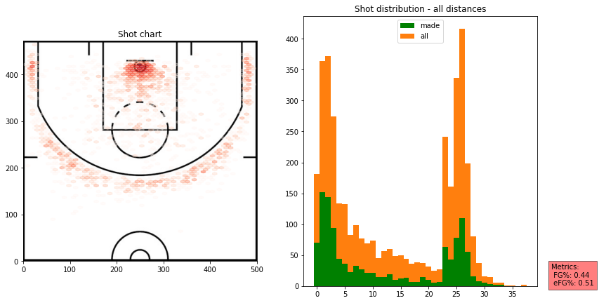
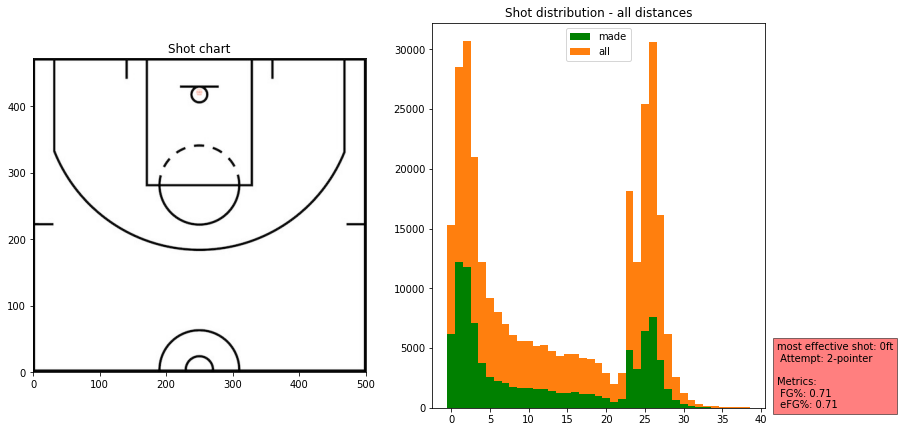
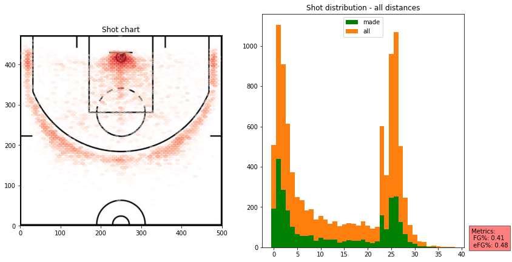
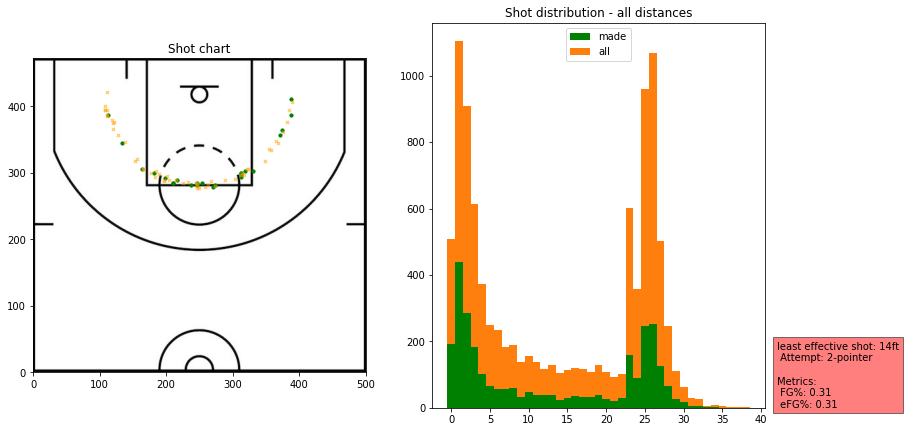
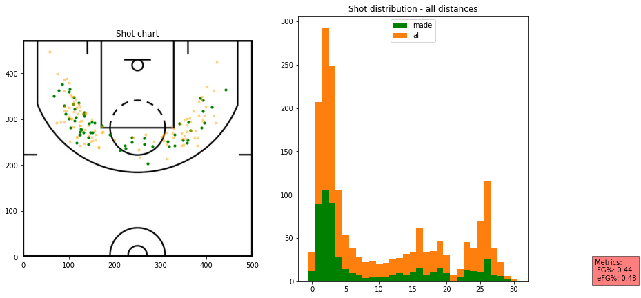
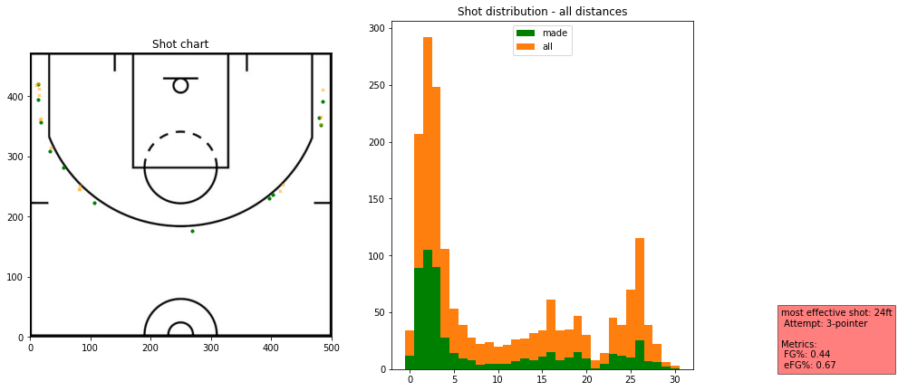
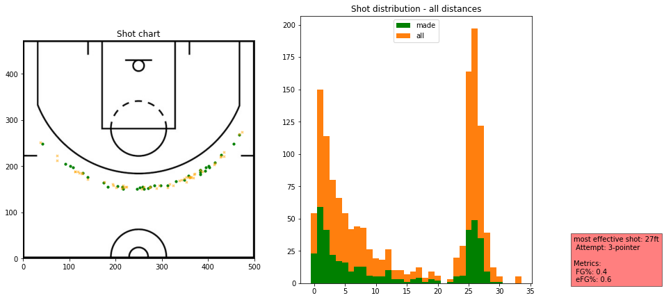
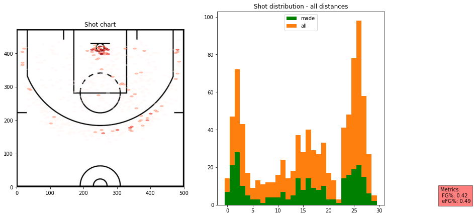
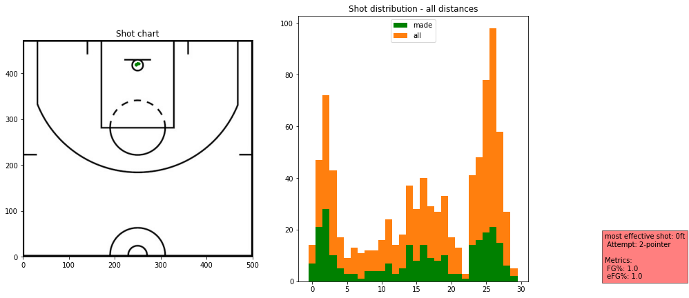
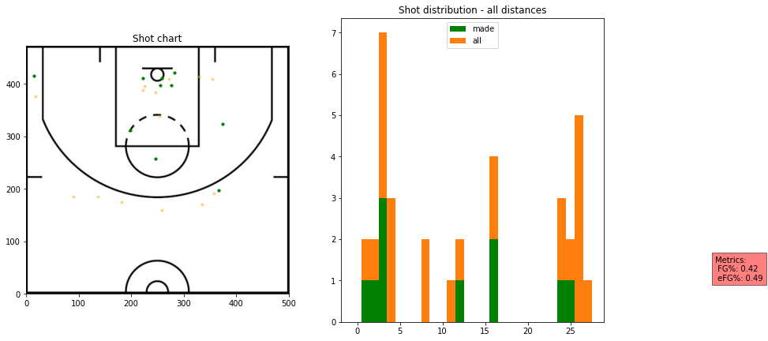

# shot_chart


<!-- WARNING: THIS FILE WAS AUTOGENERATED! DO NOT EDIT! -->

------------------------------------------------------------------------

<a
href="https://github.com/theccalderon/shot_chart/tree/master/blob/master/shot_chart/core.py#L29"
target="_blank" style="float:right; font-size:smaller">source</a>

### Config

>  Config ()

*Initialize self. See help(type(self)) for accurate signature.*

``` python
config = Config()
```

------------------------------------------------------------------------

<a
href="https://github.com/theccalderon/shot_chart/tree/master/blob/master/shot_chart/core.py#L77"
target="_blank" style="float:right; font-size:smaller">source</a>

### URLs

>  URLs ()

*Global constants for dataset and model URLs.*

## Downloading

------------------------------------------------------------------------

<a
href="https://github.com/theccalderon/shot_chart/tree/master/blob/master/shot_chart/core.py#L116"
target="_blank" style="float:right; font-size:smaller">source</a>

### download_url

>  download_url (url, dest, overwrite=False, pbar=None, show_progress=True,
>                    chunk_size=1048576, timeout=4, retries=5)

*Download `url` to `dest` unless it exists and not `overwrite`*

------------------------------------------------------------------------

<a
href="https://github.com/theccalderon/shot_chart/tree/master/blob/master/shot_chart/core.py#L150"
target="_blank" style="float:right; font-size:smaller">source</a>

### download_data

>  download_data (url, fname=None, c_key='archive', force_download=False)

*Download `url` to `fname`.*

### Extract

------------------------------------------------------------------------

<a
href="https://github.com/theccalderon/shot_chart/tree/master/blob/master/shot_chart/core.py#L158"
target="_blank" style="float:right; font-size:smaller">source</a>

### file_extract

>  file_extract (fname, dest='.')

*Extract `fname` to `dest` using `tarfile` or \`zipfile*

[`file_extract`](https://theccalderon.github.io/shot_chart/core.html#file_extract)
is used by default in
[`untar_data`](https://theccalderon.github.io/shot_chart/core.html#untar_data)
to decompress the downloaded file.

``` python
URLs.path(URLs.SHOTS_2024)
```

    Path('/Users/ccalderon/.shot_chart/archive/shots-2024.tgz')

------------------------------------------------------------------------

<a
href="https://github.com/theccalderon/shot_chart/tree/master/blob/master/shot_chart/core.py#L179"
target="_blank" style="float:right; font-size:smaller">source</a>

### untar_data

>  untar_data (url, fname=None, dest=None, c_key='data',
>                  force_download=False, extract_func=<function file_extract>)

*Download `url` to `fname` if `dest` doesn’t exist, and un-tgz to folder
`dest`.*

------------------------------------------------------------------------

<a
href="https://github.com/theccalderon/shot_chart/tree/master/blob/master/shot_chart/core.py#L196"
target="_blank" style="float:right; font-size:smaller">source</a>

### make_df

>  make_df (path)

*Creates a pandas dataframe from `path`*

``` python
shots_2021 = make_df(untar_data(URLs.SHOTS_2021))
```

### Using the `delegate` function from https://www.fast.ai/2019/08/06/delegation/

------------------------------------------------------------------------

<a
href="https://github.com/theccalderon/shot_chart/tree/master/blob/master/shot_chart/core.py#L201"
target="_blank" style="float:right; font-size:smaller">source</a>

### delegates

>  delegates (to=None, keep=False)

*Decorator: replace `**kwargs` in signature with params from `to`*

## Creating a class - Shots

------------------------------------------------------------------------

<a
href="https://github.com/theccalderon/shot_chart/tree/master/blob/master/shot_chart/core.py#L218"
target="_blank" style="float:right; font-size:smaller">source</a>

### Shots

>  Shots (dataframe)

*Plots shot chart and most/least effective shots using `plot_shots` and
`plot_effective`*

``` python
shots = Shots(shots_2021)
```

``` python
shots.players
```

    0                 Grayson Allen
    1         Giannis Antetokounmpo
    3                   Nic Claxton
    6                  James Harden
    7                   Brook Lopez
                      ...          
    203149         Gabriel Lundberg
    212992                Gabe York
    214228               Feron Hunt
    215071                Matt Ryan
    216187         Arnoldas Kulboka
    Name: shots_by, Length: 596, dtype: object

``` python
shots.plot_shots()
```


``` python
shots.plot_shots(date_range=((2021,11,1), (2021,11,18)))
```


``` python
shots.plot_shots(date_range=((2021,12,17), (2021,12,18)))
```



``` python
shots.list_game_ids(2021, 11, 17)
```

<div>
<style scoped>
    .dataframe tbody tr th:only-of-type {
        vertical-align: middle;
    }
&#10;    .dataframe tbody tr th {
        vertical-align: top;
    }
&#10;    .dataframe thead th {
        text-align: right;
    }
</style>

<table class="dataframe" data-quarto-postprocess="true" data-border="1">
<thead>
<tr style="text-align: right;">
<th data-quarto-table-cell-role="th"></th>
<th data-quarto-table-cell-role="th">game_id</th>
<th data-quarto-table-cell-role="th">winner</th>
<th data-quarto-table-cell-role="th">loser</th>
</tr>
</thead>
<tbody>
<tr>
<td data-quarto-table-cell-role="th">29106</td>
<td>202111170POR</td>
<td>Portland</td>
<td>Chicago</td>
</tr>
<tr>
<td data-quarto-table-cell-role="th">33398</td>
<td>202111170PHO</td>
<td>Phoenix</td>
<td>Dallas</td>
</tr>
<tr>
<td data-quarto-table-cell-role="th">33582</td>
<td>202111170OKC</td>
<td>Oklahoma City</td>
<td>Houston</td>
</tr>
<tr>
<td data-quarto-table-cell-role="th">33764</td>
<td>202111170NYK</td>
<td>Orlando</td>
<td>New York</td>
</tr>
<tr>
<td data-quarto-table-cell-role="th">33948</td>
<td>202111170MIN</td>
<td>Minnesota</td>
<td>Sacramento</td>
</tr>
<tr>
<td data-quarto-table-cell-role="th">34121</td>
<td>202111170MIL</td>
<td>Milwaukee</td>
<td>LA Lakers</td>
</tr>
<tr>
<td data-quarto-table-cell-role="th">34304</td>
<td>202111170MIA</td>
<td>Miami</td>
<td>New Orleans</td>
</tr>
<tr>
<td data-quarto-table-cell-role="th">34463</td>
<td>202111170DET</td>
<td>Detroit</td>
<td>Indiana</td>
</tr>
<tr>
<td data-quarto-table-cell-role="th">34621</td>
<td>202111170CHO</td>
<td>Charlotte</td>
<td>Washington</td>
</tr>
<tr>
<td data-quarto-table-cell-role="th">34807</td>
<td>202111170BRK</td>
<td>Brooklyn</td>
<td>Cleveland</td>
</tr>
<tr>
<td data-quarto-table-cell-role="th">34979</td>
<td>202111170ATL</td>
<td>Atlanta</td>
<td>Boston</td>
</tr>
</tbody>
</table>

</div>

``` python
shots.plot_shots(date_range="202111170PHO")
```


``` python
shots.plot_effective(most_or_least="most", metric="efg")
```


``` python
shots.plot_effective(most_or_least="most", metric="efg", exclude=['0ft','1ft','2ft','23ft'])
```


``` python
shots.plot_effective(most_or_least="most", min_shots="auto",exclude=['1ft','2ft','23ft','24ft','25ft','26ft','27ft'])
```



``` python
shots.plot_effective(most_or_least="least", min_shots='auto',exclude=['24ft','23ft'])
```


## List teams

------------------------------------------------------------------------

<a
href="https://github.com/theccalderon/shot_chart/tree/master/blob/master/shot_chart/core.py#L407"
target="_blank" style="float:right; font-size:smaller">source</a>

### list_teams

>  list_teams (dataframe)

*Lists all the teams in `dataframe`*

``` python
print(list_teams(shots_2021))
```

    0          Milwaukee
    3           Brooklyn
    189         Oklahoma
    190             Utah
    371            Miami
    551       Washington
    552          Indiana
    742           Dallas
    743          Toronto
    917       Sacramento
    918     Golden State
    1100         Chicago
    1264          Denver
    1608         Atlanta
    1796         Orlando
    1967     LA Clippers
    1968        Portland
    2153     New Orleans
    2330       Charlotte
    2511       LA Lakers
    2512       Cleveland
    3009         Detroit
    3011    Philadelphia
    3171         Houston
    3351         Memphis
    3538     San Antonio
    3716        New York
    4063         Phoenix
    4788       Minnesota
    5321          Boston
    Name: team, dtype: object

## List unique game ids

------------------------------------------------------------------------

<a
href="https://github.com/theccalderon/shot_chart/tree/master/blob/master/shot_chart/core.py#L412"
target="_blank" style="float:right; font-size:smaller">source</a>

### list_game_ids

>  list_game_ids (dataframe, year, month, day)

*Lists unique game ids in `dataframe` for a given date*

``` python
list_game_ids(shots_2021,2021,11,17)
```

<div>
<style scoped>
    .dataframe tbody tr th:only-of-type {
        vertical-align: middle;
    }
&#10;    .dataframe tbody tr th {
        vertical-align: top;
    }
&#10;    .dataframe thead th {
        text-align: right;
    }
</style>

<table class="dataframe" data-quarto-postprocess="true" data-border="1">
<thead>
<tr style="text-align: right;">
<th data-quarto-table-cell-role="th"></th>
<th data-quarto-table-cell-role="th">game_id</th>
<th data-quarto-table-cell-role="th">winner</th>
<th data-quarto-table-cell-role="th">loser</th>
</tr>
</thead>
<tbody>
<tr>
<td data-quarto-table-cell-role="th">29106</td>
<td>202111170POR</td>
<td>Portland</td>
<td>Chicago</td>
</tr>
<tr>
<td data-quarto-table-cell-role="th">33398</td>
<td>202111170PHO</td>
<td>Phoenix</td>
<td>Dallas</td>
</tr>
<tr>
<td data-quarto-table-cell-role="th">33582</td>
<td>202111170OKC</td>
<td>Oklahoma City</td>
<td>Houston</td>
</tr>
<tr>
<td data-quarto-table-cell-role="th">33764</td>
<td>202111170NYK</td>
<td>Orlando</td>
<td>New York</td>
</tr>
<tr>
<td data-quarto-table-cell-role="th">33948</td>
<td>202111170MIN</td>
<td>Minnesota</td>
<td>Sacramento</td>
</tr>
<tr>
<td data-quarto-table-cell-role="th">34121</td>
<td>202111170MIL</td>
<td>Milwaukee</td>
<td>LA Lakers</td>
</tr>
<tr>
<td data-quarto-table-cell-role="th">34304</td>
<td>202111170MIA</td>
<td>Miami</td>
<td>New Orleans</td>
</tr>
<tr>
<td data-quarto-table-cell-role="th">34463</td>
<td>202111170DET</td>
<td>Detroit</td>
<td>Indiana</td>
</tr>
<tr>
<td data-quarto-table-cell-role="th">34621</td>
<td>202111170CHO</td>
<td>Charlotte</td>
<td>Washington</td>
</tr>
<tr>
<td data-quarto-table-cell-role="th">34807</td>
<td>202111170BRK</td>
<td>Brooklyn</td>
<td>Cleveland</td>
</tr>
<tr>
<td data-quarto-table-cell-role="th">34979</td>
<td>202111170ATL</td>
<td>Atlanta</td>
<td>Boston</td>
</tr>
</tbody>
</table>

</div>

## Inheriting from Shots to create TeamShots

------------------------------------------------------------------------

<a
href="https://github.com/theccalderon/shot_chart/tree/master/blob/master/shot_chart/core.py#L418"
target="_blank" style="float:right; font-size:smaller">source</a>

### TeamShots

>  TeamShots (dataframe, team)

*Team shots*

``` python
team_shots = TeamShots(shots_2021,"Portland")
```

``` python
team_shots.team
```

    'Portland'

``` python
team_shots.plot_shots()
```



``` python
team_shots.plot_effective()
```


``` python
team_shots.dataframe.loc[(team_shots.dataframe['distance']=='24ft') & (team_shots.dataframe['attempt']=='2-pointer')]
```

<div>
<style scoped>
    .dataframe tbody tr th:only-of-type {
        vertical-align: middle;
    }
&#10;    .dataframe tbody tr th {
        vertical-align: top;
    }
&#10;    .dataframe thead th {
        text-align: right;
    }
</style>

<table class="dataframe" data-quarto-postprocess="true" data-border="1">
<thead>
<tr style="text-align: right;">
<th data-quarto-table-cell-role="th"></th>
<th data-quarto-table-cell-role="th">Unnamed: 0</th>
<th data-quarto-table-cell-role="th">game_id</th>
<th data-quarto-table-cell-role="th">year</th>
<th data-quarto-table-cell-role="th">month</th>
<th data-quarto-table-cell-role="th">day</th>
<th data-quarto-table-cell-role="th">winner</th>
<th data-quarto-table-cell-role="th">loser</th>
<th data-quarto-table-cell-role="th">x</th>
<th data-quarto-table-cell-role="th">y</th>
<th data-quarto-table-cell-role="th">play</th>
<th data-quarto-table-cell-role="th">time_remaining</th>
<th data-quarto-table-cell-role="th">quarter</th>
<th data-quarto-table-cell-role="th">shots_by</th>
<th data-quarto-table-cell-role="th">outcome</th>
<th data-quarto-table-cell-role="th">attempt</th>
<th data-quarto-table-cell-role="th">distance</th>
<th data-quarto-table-cell-role="th">team</th>
<th data-quarto-table-cell-role="th">winner_score</th>
<th data-quarto-table-cell-role="th">loser_score</th>
</tr>
</thead>
<tbody>
<tr>
<td data-quarto-table-cell-role="th">103047</td>
<td>102971</td>
<td>202201130DEN</td>
<td>2022</td>
<td>1</td>
<td>13</td>
<td>Denver</td>
<td>Portland</td>
<td>268px</td>
<td>256px</td>
<td>4th quarter, 3:41.0 remaining&lt;br&gt;Tony Snell ma...</td>
<td>3:41.0</td>
<td>4</td>
<td>Tony Snell</td>
<td>made</td>
<td>2-pointer</td>
<td>24ft</td>
<td>Portland</td>
<td>128</td>
<td>99</td>
</tr>
<tr>
<td data-quarto-table-cell-role="th">185595</td>
<td>185678</td>
<td>202203280POR</td>
<td>2022</td>
<td>3</td>
<td>28</td>
<td>Oklahoma City</td>
<td>Portland</td>
<td>261px</td>
<td>312px</td>
<td>1st quarter, 7:36.0 remaining&lt;br&gt;Keon Johnson ...</td>
<td>7:36.0</td>
<td>1</td>
<td>Keon Johnson</td>
<td>missed</td>
<td>2-pointer</td>
<td>24ft</td>
<td>Portland</td>
<td>11</td>
<td>12</td>
</tr>
</tbody>
</table>

</div>

``` python
team_shots.plot_effective(most_or_least="least")
```



``` python
team_shots = TeamShots(shots_2021,"Houston")
```

``` python
team_shots.plot_shots()
```


``` python
team_shots.plot_shots(date_range=((2021,12,3), (2021,12,8)))
```


``` python
team_shots.plot_effective("least")
```


``` python
team_shots = TeamShots(shots_2021,"LA Lakers")
team_shots.plot_shots()
```


## List players who took shots for a team

------------------------------------------------------------------------

<a
href="https://github.com/theccalderon/shot_chart/tree/master/blob/master/shot_chart/core.py#L426"
target="_blank" style="float:right; font-size:smaller">source</a>

### list_team_players

>  list_team_players (dataframe, team)

*Lists the players in `dataframe` who took shots for a `team`*

``` python
list_team_players(shots_2021,'LA Lakers')
```

<div>
<style scoped>
    .dataframe tbody tr th:only-of-type {
        vertical-align: middle;
    }
&#10;    .dataframe tbody tr th {
        vertical-align: top;
    }
&#10;    .dataframe thead th {
        text-align: right;
    }
</style>

<table class="dataframe" data-quarto-postprocess="true" data-border="1">
<thead>
<tr style="text-align: right;">
<th data-quarto-table-cell-role="th"></th>
<th data-quarto-table-cell-role="th">shots_by</th>
<th data-quarto-table-cell-role="th">count</th>
</tr>
</thead>
<tbody>
<tr>
<td data-quarto-table-cell-role="th">18</td>
<td>Russell Westbrook</td>
<td>1233</td>
</tr>
<tr>
<td data-quarto-table-cell-role="th">13</td>
<td>LeBron James</td>
<td>1221</td>
</tr>
<tr>
<td data-quarto-table-cell-role="th">15</td>
<td>Malik Monk</td>
<td>824</td>
</tr>
<tr>
<td data-quarto-table-cell-role="th">3</td>
<td>Carmelo Anthony</td>
<td>723</td>
</tr>
<tr>
<td data-quarto-table-cell-role="th">0</td>
<td>Anthony Davis</td>
<td>695</td>
</tr>
<tr>
<td data-quarto-table-cell-role="th">21</td>
<td>Talen Horton-Tucker</td>
<td>537</td>
</tr>
<tr>
<td data-quarto-table-cell-role="th">2</td>
<td>Avery Bradley</td>
<td>349</td>
</tr>
<tr>
<td data-quarto-table-cell-role="th">1</td>
<td>Austin Reaves</td>
<td>315</td>
</tr>
<tr>
<td data-quarto-table-cell-role="th">20</td>
<td>Stanley Johnson</td>
<td>251</td>
</tr>
<tr>
<td data-quarto-table-cell-role="th">23</td>
<td>Wayne Ellington</td>
<td>237</td>
</tr>
<tr>
<td data-quarto-table-cell-role="th">8</td>
<td>Dwight Howard</td>
<td>219</td>
</tr>
<tr>
<td data-quarto-table-cell-role="th">12</td>
<td>Kent Bazemore</td>
<td>136</td>
</tr>
<tr>
<td data-quarto-table-cell-role="th">22</td>
<td>Trevor Ariza</td>
<td>99</td>
</tr>
<tr>
<td data-quarto-table-cell-role="th">24</td>
<td>Wenyen Gabriel</td>
<td>97</td>
</tr>
<tr>
<td data-quarto-table-cell-role="th">7</td>
<td>DeAndre Jordan</td>
<td>89</td>
</tr>
<tr>
<td data-quarto-table-cell-role="th">5</td>
<td>D.J. Augustin</td>
<td>86</td>
</tr>
<tr>
<td data-quarto-table-cell-role="th">17</td>
<td>Rajon Rondo</td>
<td>71</td>
</tr>
<tr>
<td data-quarto-table-cell-role="th">9</td>
<td>Isaiah Thomas</td>
<td>39</td>
</tr>
<tr>
<td data-quarto-table-cell-role="th">16</td>
<td>Mason Jones</td>
<td>15</td>
</tr>
<tr>
<td data-quarto-table-cell-role="th">19</td>
<td>Sekou Doumbouya</td>
<td>8</td>
</tr>
<tr>
<td data-quarto-table-cell-role="th">6</td>
<td>Darren Collison</td>
<td>7</td>
</tr>
<tr>
<td data-quarto-table-cell-role="th">4</td>
<td>Chaundee Brown</td>
<td>7</td>
</tr>
<tr>
<td data-quarto-table-cell-role="th">14</td>
<td>Mac McClung</td>
<td>5</td>
</tr>
<tr>
<td data-quarto-table-cell-role="th">11</td>
<td>Jemerrio Jones</td>
<td>3</td>
</tr>
<tr>
<td data-quarto-table-cell-role="th">10</td>
<td>Jay Huff</td>
<td>3</td>
</tr>
</tbody>
</table>

</div>

## Inheriting from Shots to create PlayerShots

------------------------------------------------------------------------

<a
href="https://github.com/theccalderon/shot_chart/tree/master/blob/master/shot_chart/core.py#L431"
target="_blank" style="float:right; font-size:smaller">source</a>

### PlayerShots

>  PlayerShots (dataframe, player)

*Player shots*

``` python
player_shots = PlayerShots(shots_2021,"Kevin Durant")
```

``` python
player_shots.fg_pct
```

    0.52

``` python
player_shots.efg_pct
```

    0.57

``` python
player_shots.plot_shots()
```


``` python
player_shots = PlayerShots(shots_2021,"Russell Westbrook")
```

``` python
player_shots.plot_shots(distance_limit=(16,26),attempt="2-pointer")
```



``` python
player_shots.plot_effective(metric="efg", exclude=['0ft','22ft',"1ft"])
```



``` python
player_shots.plot_effective(metric="efg", min_shots="auto",exclude=['2ft'])
```


``` python
player_shots = PlayerShots(shots_2021,"James Harden")
```

``` python
player_shots.plot_effective(metric="efg", exclude=['16ft',"0ft","11ft",'1ft'])
```


``` python
player_shots.plot_effective(min_shots="auto",exclude=['1ft','28ft','2ft','3ft'])
```



``` python
player_shots = PlayerShots(shots_2021, 'Paul George')
```

``` python
player_shots.list_game_ids(2021,11,16)
```

<div>
<style scoped>
    .dataframe tbody tr th:only-of-type {
        vertical-align: middle;
    }
&#10;    .dataframe tbody tr th {
        vertical-align: top;
    }
&#10;    .dataframe thead th {
        text-align: right;
    }
</style>

<table class="dataframe" data-quarto-postprocess="true" data-border="1">
<thead>
<tr style="text-align: right;">
<th data-quarto-table-cell-role="th"></th>
<th data-quarto-table-cell-role="th">game_id</th>
<th data-quarto-table-cell-role="th">winner</th>
<th data-quarto-table-cell-role="th">loser</th>
</tr>
</thead>
<tbody>
<tr>
<td data-quarto-table-cell-role="th">35143</td>
<td>202111160LAC</td>
<td>LA Clippers</td>
<td>San Antonio</td>
</tr>
</tbody>
</table>

</div>

``` python
player_shots.plot_shots()
```



``` python
player_shots.plot_effective()
```



``` python
player_shots.plot_shots(date_range='202111160LAC')
```


